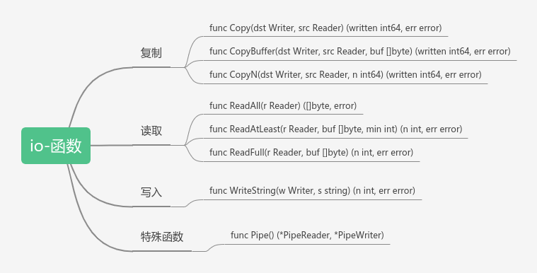

# io包

## 简介
`io`包提供了`系统io`最基本的封装，可以用来进行文件的读取，写入，复制等功能。不是线程安全的。

## 思维导图概览
由于思维导图比较大，这边就不放图了,提供两种途径观看
- [在线浏览思维导图](https://www.processon.com/view/link/605c48f2e401fd4c0398b4cd#map)
- [下载思维导入（可以用xmind工具打开）](https://cdn.jsdelivr.net/gh/greycodee/golang-wiki@main/mind/io.xmind)

## 功能
上面思维导图中虽然方法，接口一大堆，但是我们正常用的话用下面的几个函数就可以了，这几个函数也是对`io`包里的方法进一步封装。


### 复制

#### func Copy

```go
func Copy(dst Writer, src Reader) (written int64, err error)
```
这个函数可以进行文件夹的复制功能，`dest`参数是目标文件，`src`参数是源文件。可以实现`src`文件复制到`dst`文件的功能。返回值`written`是复制文件的大小

代码演示：
```go
package main

import (
	"fmt"
	"io"
	"os"
	"strings"
)

func main() {
	src:=strings.NewReader("这是源文件字符串流")
	l,_:=io.Copy(os.Stdout,src)
	fmt.Printf("\n复制的数据大小：%d",l)
}

// 输出
这是源文件字符串流
复制的数据大小：27

```

上面的历史是将`字符串流`复制到了`系统输出流`里，然后输出了复制的数据大小

#### func CopyBuffer
```go
func CopyBuffer(dst Writer, src Reader, buf []byte) (written int64, err error)
```
`CopyBuffer`与`Copy`相同，区别在于`CopyBuffer`逐步遍历提供的缓冲区，而不是分配一个临时缓冲区。**如果`buf`为`nil`，则分配一个（`func Copy`就是调用了这个函数，然后`buf`传了`nil`）**；如果长度为`0`，则`CopyBuffer`会报异常。